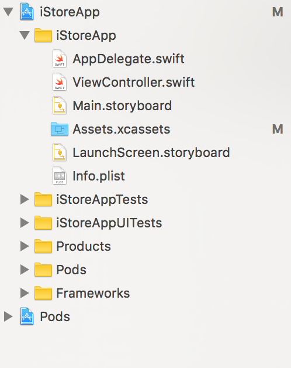

#Start Your First Mobile Shopping App with the Moltin eCommerce Platform


##Introduction

Moltin is a new in the big world of eCommerce, offering a mobile backend as a service (BaaS) for online shops. Competing directly with established providers such as Shopify, the platform packs a lot of features including order, billing, product listing, inventory and many more, a compelling offering for anyone starting an eCommerce business today. 

If you have used Firebase before, you will be familiar with the concept of mobile backend as a service (MBaaS). The platform offers a very comprehensive set of REST API endpoints for querying customer information, updating the stock and making a purchase. It may appeal to businesses who are focused on driving the mobile eCommerce market, because lowering cost and shortening time to market may be big factors in success in a competitive and fast changing market. 

For this tutorial, I will guide you on how to sign up on [Moltin](http://www.moltin.com) for a free account through to creating you own web store and iPhone shopping app. In first part of the tutorial I am going to create a hypothetical electronic gadget store, called "iStore". Feel free to be creative. Our customers wouldn't be able to buy the latest gadgets as they have no way of accessing our store, which is why in the second part, we will be creating an iPhone app to sell our products.

This tutorial uses Moltin's iOS SDK which you can download here:
[Moltin iOS SDK](https://github.com/moltin/ios-sdk)

#Part I. Building the Web Store

In order to create our web store, we need to sign up for a free account on Moltin.com. Simply open up your favourite browser and type `www.moltin.com` into the address bar. Once you are there, click on `Sign Up` and fill in your name and email address. 

**OR**

[click on this link](https://accounts.moltin.com/register)

Great! We have created our account.

Now we want to customize our web store. When you login to your account on [Moltin](https://www.moltin.com), you will notice that the default store has already been created for you, change the name of your store to anything to your liking. I have changed mine to "iStore". 

You will also need to make a note of the API keys for calling API on your store. There are two keys:

* Client ID
* Client secret

The client ID or "public ID" is needed for most API calls. It gives you basic level of access privileges. We are going to use it on the shopping app to communicate with the store backend.

You should keep the client secret safe and never reveal it or copy-paste it into source code.

You will also notice the API usage counter. For purpose of this tutorial, the 30000 is more enough. 

Next, go to [Moltin](https://www.moltin.com)'s home page. Click on `Log In` and in the dropdown, choose `Forge Dashboard`. We are going to customise our newly created store with products.

**OR**

[Click on this link](https://forge.moltin.com/)

##Create Products

It's time to list some products for our gadget store. On the left sidebar, click on `Inventory` button, which reveals 4 options. We would like to add products to our store, so click on `Products`. The other three options help us group products into categories or collections, you can explore on in your own time, but for the purpose of this tutorial, we will not be creating categories or   


Click on the green button on the top right to begin add our first product to the shop. 

You have to fill in the required fields and hit the `Submit` button at the bottom to save.


**Note**: Each product must have a category. For now we can leave it in the *Uncategorized* category.

Upon submitting the product information, you can add further information, such product variables in the `Modifiers` tab or images by clicking on the `Images` tab. I am going to add one picture for the product.


I am going to add two more products because I think they are going to be very popular and make me a lot of money.


##Create a Customer Account
Before we finish customising our web store, there is one final thing we have to do. That is creating a test user for accessing the store. 

On the left hand-side of side bar menu, click on "Customers". We will set up a customer account. A customer account has the convenient to speed up check out by saving customer information such as shipping address, credit card number. 


**Note**: In real life, you will want to create customer sign up pages instead of directly creating account from the dashboard. Moltin's Customer API is able to register new customers. Creating registration work flow is beyond this tutorial and I suggest you look into the develop documentation for more information.

Now that we have created our web store, it's time to create a bespoke shopping app for customer to buy products from us.

#Part II. Building the iPhone App

We are ready to create a simple app that will allow customers to interact with our store on their phones. This is where the real fun begins. For this part you will need:

* Xcode 8 
* CocoaPods
* Git

##Setting up the Project Workspace
Let's open Xcode and create a new Swift project, with the name 'iStoreApp' and use the 'single view application' 

Now run the following command from the terminal:
```
pod init
```
This commands creates a dummy file called `Podfile` in your project directory. We are going to edit it with Xcode and add Moltin iOS SDK to the dependency. 
```
open -a "xcode" Podfile 
```
Delete everything in the pod file and add this snippet:
```
target 'iStoreApp' do
  use_frameworks!
  pod 'Moltin', '~> 1.1'
end
```
Finally install the SDK with command:
```
pod install
```
Setting up workspace is something every iOS developer will eventually get used to. Memorising these commands will save you a lot of time in the future.

##Create the Login Screen
Double click on the file called  `iStore.xcworkspace` from the project directory will bring up Xcode. It's time for some fun coding with the new version of Apple's iOS development language, Swift 3.

You should have a project structure similar to mine:
 

We are going to rename `ViewController.swift` to `LoginController.swift`. This will be the code for our login controller. While you are at it, you will want to change the name of the class from `ViewController` to `LoginController`.

Switching our attention to implementing the user interface. If you open `Main.storyboard` you will see a view controller already created for you. We will customise it.

1. Select the view controller and change its custom class to `LoginController`.
2. From the object library on lower right hand-side, drag a label on to `LoginController`'s view. Change its text to 'iStore'. 
3. Set the label's font to 'Futura' with size 36 points. Also change the label's alignment to centre.
3. Hold `ctrl` key and click drag the cursor from the label on to the container view and release the cursor. A menu should pop up inviting us to set constraints on the label. Choose option "centre horizontally in container".
4. Repeat step 3 but this time drag the mouse from the label to the top of its parent view before releasing. In the pop up menu, choose to set "vertical spacing to top layout guide". 
5. Press `alt` + `cmd` + `=` to let Xcode automatically position the label according to the constraints we set.

This is the work so far:


So far so good.

We are going to drag a text fields on to the view. It is going to allow user to enter email address.

A quick way to add constraints to our view components is to use `pin` tool from the interface designer.


I choose a top spacing of 80 pixels, left spacing 0 and right spacing of 0. When you hit "Add 3 constraints" button, the interface designer will generate the constraints for us. Make sure "constraint to margins" option is checked.

We can further customise the text field by:

* set font size to 20 points
* Set alignment to centre
* Set placeholder text to "Email"
* Set keyboard type to "Email address"

Next we are going drag another text fied and place it below the email text field. Again, with the `pin` tool we can set the spacing:

* top spacing: 20
* left spacing: 0
* right spacing: 0

We are going to edit the text field's property to be consistent with the email text field, except we want to give it a placeholder text "Password". What we also need to do is check "Secure Text Entry" option to display the password dots.

Finally, drag a button on to the view just below the password field. Use the `pin` tool to set top spacing to 45 pixels, and left/right spacing to 0 pixels. Change the font size to 20 points and button title to "Login".

This is the final result of the login view.


##Call and Test Login API
Open `AppDelegate.swift`, we would like to run some set up code when the app finishes launching. Before we do that, let's import the Moltin SDK. At the top of the file add:

```
import Moltin
```
We tell the Moltin API instance to use the client ID for our store:
```
func application(_ application: UIApplication, didFinishLaunchingWithOptions launchOptions: [UIApplicationLaunchOptionsKey: Any]?) -> Bool {
        Moltin.sharedInstance().setPublicId("repalce-with-your-clientid")
        return true
    }
```

Next open up the main storyboard again. Use the hotkey `alt` +`cmd`+`enter` to bring up the assistant editor next to the interface designer. Hold `ctrl` while dragging from email text field to the `LoginController`'s code. You can create outlets for both the email text field and password text field, plus the login button.

```
import UIKit
import Moltin

class LoginController: UIViewController {
    @IBOutlet var loginButton: UIButton!
    @IBOutlet var emailField: UITextField!
    @IBOutlet var passwordField: UITextField!
    //... rest of the controller's code
}
```

We are going add a function to `LoginController` to perform the actually login.
```
class LoginController: UIViewController {
    // ...
    override func viewDidLoad() {
        super.viewDidLoad()
        loginButton.addTarget(self, action: #selector(doLogin), for: .touchUpInside)
    }
    func doLogin(sender: UIButton) -> Void
    {
        let email = emailField.text!
        let password = passwordField.text!
        Moltin.sharedInstance().customer.login(withEmail: email, andPassword: password, success: { (response: [AnyHashable : Any]?) in
            self.showAlert(title: "Success", message: "Successfully logged you in.")
            if(response != nil){
                let result = response?["result"] as! Dictionary<String, Any>
                UserDefaults.standard.set(result["token"],forKey:"customerToken")
                UserDefaults.standard.synchronize()
            }
        }) { (response: [AnyHashable : Any]?, error: Error?) in
            self.showAlert(title: "Can't log you in", message: "Email/Password combination is not found.")
        }
    }
    func showAlert(title: String, message: String)
    {
        let alertController = UIAlertController(title: title, message: message, preferredStyle: .alert)
        let okAction = UIAlertAction(title: "OK", style: .default, handler: nil)
        alertController.addAction(okAction)
        self.present(alertController, animated: true, completion: nil)
    }
}
```

In the `viewDidLoad` method we set up the login button to call `doLogin` method when the user presses it.

We use `Moltin.customer.login`  method to call the login REST API on our behalf. The method takes two callbacks for cases when the login is successful or failed. Inside the success callback, we need to retrieve the customer authentication token from the response and save it to `UserDefaults` so it can be used later.

Next we are going to create a product listing to showcase awesome gadgets in our shop.

##Create Product Listing

Open up the main storyboard, we are going to add a navigation controller and a table view controller. Drag the cursor from the navigation controller onto the table view controller. In the popup, choose "root view controller". Click on the navigation bar at the top of the table view controller and set its title to "iStore products".


 
The table view is going to display a list of products for our store. In order to do that, the prototype cell will be customised with an image view, a text label to product title and a text label for its price.


##Wire Things Together

First things first, let's create a custom view controller class for the table view controller, I named mine "ProductListController". In the interface builder, you will changed the table view controller's custom class to the name of class you have just created. 

```
//ProductListController.swift
import UIKit
import Moltin

class ProductListController : UITableViewController {
	//...
}
```

The table cells are going to be backed by a custom class. We will create a new swift file with name `ProductListItem.swift`.

```
//ProductListItem.swift
import UIKit

class ProductListItem : UITableViewCell {
	static let CellIdentifier = "ProductListCell"
    // empty
}
```
Open the main storyboard when you have created the new swift file. We need to link the views in prototype cell we have created with our class. The first step is to change the custom class of the prototype cell to the "ProductListItem". In addition, the reuse identifier must be set to the same value as the "CellIdentifier" static field.

Next we create the outlets from prototype cell to our custom table cell view class. Same as before, by dragging while holding down `ctrl`, we can create references for the views inside of our custom view class. It allows the `ProductListItem` class to update itself .

```
// ProductListItem.swift
import UIKit

class ProductListItem : UITableViewCell {
    
    @IBOutlet var priceLabel: UILabel!
    @IBOutlet var titleLabel: UILabel!
    @IBOutlet var productImage: UIImageView!
    // ...
}
```
We want write maintainable code by following good design patterns. It's a good idea to abstract the product we are displaying into a class, called `Product`. 

```
//Product.swift
import Foundation
struct Product {
    var title: String?
    var price: String?
    var imageUrl: URL?
    
    init(title: String?, price: String?, imageUrl: URL?) {
        self.title = title
        self.price = price
        self.imageUrl = imageUrl
    }
}
```

We can write the logic to display a product object:
```
//ProductListItem.swift
import UIKit

class ProductListItem : UITableViewCell {
    
    @IBOutlet var priceLabel: UILabel!
    @IBOutlet var titleLabel: UILabel!
    @IBOutlet var productImage: UIImageView!
    static let CellIdentifier = "ProductListCell"
    var product: Product! {
        didSet {
            titleLabel.text = product.title
            priceLabel.text = product.price
            DispatchQueue.global().async {
                let data = try? Data(contentsOf: self.product.imageUrl!)
                DispatchQueue.main.async {
                    self.productImage.image = UIImage(data: data!)
                }
            }
        }
    }
}
```
**Note**: When making network calls, in this instance, downloading an image from the internet, we have to dispatch the work off of main thread, so the UI performance is not affected.

In the `ProductListController`, we will make API calls using Moltin SDK to get a list of products from the server. 

```
import UIKit
import Moltin

class ProductListController : UITableViewController {
    
    var products: [Product] = []
    
    override func viewDidLoad() {
        super.viewDidLoad()
    }
    override func viewDidAppear(_ animated: Bool) {
        super.viewDidAppear(animated)
        Moltin.sharedInstance().product.search(withParameters: ["name": ""], success: { (response: [AnyHashable : Any]?) in
            if response != nil{
                self.setProducts(json: response!)
            }
        }) { (response: [AnyHashable : Any]?, error:Error?) in
            
        }
    }
    override func numberOfSections(in tableView: UITableView) -> Int {
        return 1
    }
    override func tableView(_ tableView: UITableView, numberOfRowsInSection section: Int) -> Int {
        return products.count
    }
    override func tableView(_ tableView: UITableView, cellForRowAt indexPath: IndexPath) -> UITableViewCell {
        var cell = tableView
            .dequeueReusableCell(withIdentifier: ProductListItem.CellIdentifier, for: indexPath)
            as! ProductListItem
        cell.product = products[indexPath.row]
        return cell
    }
    func setProducts(json:[AnyHashable: Any]){
        typealias Json = [AnyHashable: Any]
        products = [];
        let result = json["result"] as! [Json]
        
        for productJson in result {
            let title = productJson["title"] as! String
                let priceJson = productJson["price"] as! Json
                    let price = priceJson["value"] as! String
            print(productJson["images"])
            let imageJson = (productJson["images"] as! [AnyObject])[0]
            let imageUrlJson = imageJson["url"] as! Json
                    let imageUrl = URL(string: imageUrlJson["https"] as! String)
            let product = Product(title: title, price: price, imageUrl: imageUrl)
            products.append(product)
        }
        
        tableView.reloadData()
    }
}
```

The last thing we do is modify `LoginController` so that when a user successful logs in, the app will show the product list. So to do that, let's set a storyboard ID on the navigation controller. 


 
 We are then going to modify the success callback 
```
//LoginController.swift
class LoginController: UIViewController {
	// ...
	func doLogin(sender: UIButton) -> Void
    {
        let email = emailField.text!
        let password = passwordField.text!
        Moltin.sharedInstance().customer.login(withEmail: email, andPassword: password, success: { (response: [AnyHashable : Any]?) in
            self.showAlert(title: "Success", message: "Successfully logged you in.")
            if(response != nil){
                let result = response?["result"] as! Dictionary<String, Any>
                UserDefaults.standard.set(result["token"],forKey:"customerToken")
                UserDefaults.standard.synchronize()
            }
			// Instantiate the controller using storyboard ID
            let navigationController =
                self.storyboard?.instantiateViewController(withIdentifier: "RootNavigationController")
            UIApplication.shared.keyWindow?.rootViewController = navigationController
            
        }) { (response: [AnyHashable : Any]?, error: Error?) in
            self.showAlert(title: "Can't log you in", message: "Email/Password combination is not found.")
        }
    }

	//...
}
```
##Running the App

Congratulations if you have followed so far! It's time to hit the run button on Xcode and view how our app turns.


Mine turned out to be pretty OK.

#Closing Remarks

We deliberately skipped a few areas that would make the app into a usable product. The user should expect to be able to add products to shopping cart, check out with credit card, etc. A single tutorial is not enough to teach all of the aspects of eCommerce app development.

We have also taken a few short cuts, for example, we did not validate user input. In a production apps, it is a good idea to always validate the user's input so the user can get interactive feedback.

That's it for this tutorial. Thank you very much for reading so far. I hope you enjoyed the experience of building your own mobile shopping app.

Special thanks to Moltin for sponsoring this tutorial.